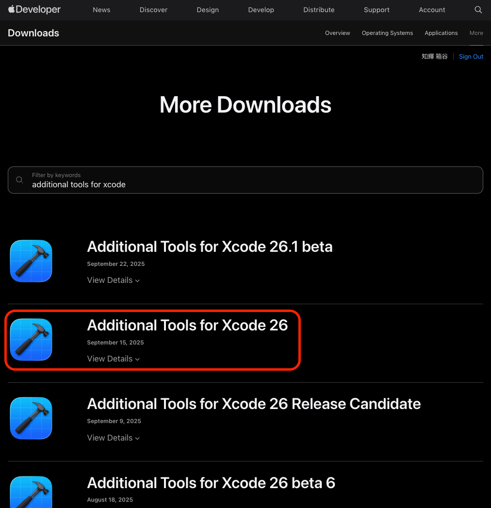

# make_eijiro_dic

英辞郎のテキストファイルを Mac 用の辞書に変換

[OS X の「辞書」アプリで「英辞郎」を使う](http://www.binword.com/blog/archives/000569.html) の一部を変更したものになります。


# 事前準備

- [英辞郎の辞書を購入](https://booth.pm/ja/items/777563)
- ruby (自分は`2.3.6`で実行しております。)
- Xcode11

# Auxiliary Tools for Xcode のインストール

Xcode11 では、Additional Tools for Xcode 11 に統合されております。

https://developer.apple.com/download/more/
より DL してください。



DL したファイルから、`Dictionary Development Kit` を探して任意の Dir にコピーしてください。※1

※1 コピーしたファイルに合わせて、Makefile の `DICT_BUILD_TOOL_DIR` のパスを変更してください。

# 英辞郎を UTF-8 に変換

- nkf をインストール

```
brew install nkf
```

CP932 → UTF-8 変換

```
nkf -w --cp932 英辞郎.txt > eijiro-utf8.txt
```

# 辞書作成手順

eijiro-utf8.txt を make_eijiro_dic 配下にコピーして以下のコマンドを実行してください。
※ MacBook Pro (2016)で 20 分弱

```
cd make_eijiro_dic
rm MyDictionary.xml; ruby eiji_conv.rb < eijiro-utf8.txt > MyDictionary.xml
```

# 辞書の抜け漏れ確認

以下のコマンドで、作成した辞書内の見出し語の抜け漏れを確認をすることができます。

```
cd make_eijiro_dic
python3 scripts/check_missing_headwords.py eijiro-utf8.txt MyDictionary.xml
```

# 英辞郎.dictionary の作成とインストール

Makefile のパスを各環境に合わせて変更してから実行してください。
※ MacBook Pro (2016)で 8 時間弱

```
cd make_eijiro_dic
make; make install
```

# 辞書の適用

作成に成功していれば、以下のコマンドでファイルが作成されていることが確認できます。

```
ls ~/Library/Dictionaries/英辞郎.dictionary
```

辞書.app の環境設定にて `英辞郎` にチェックを入れてください。


